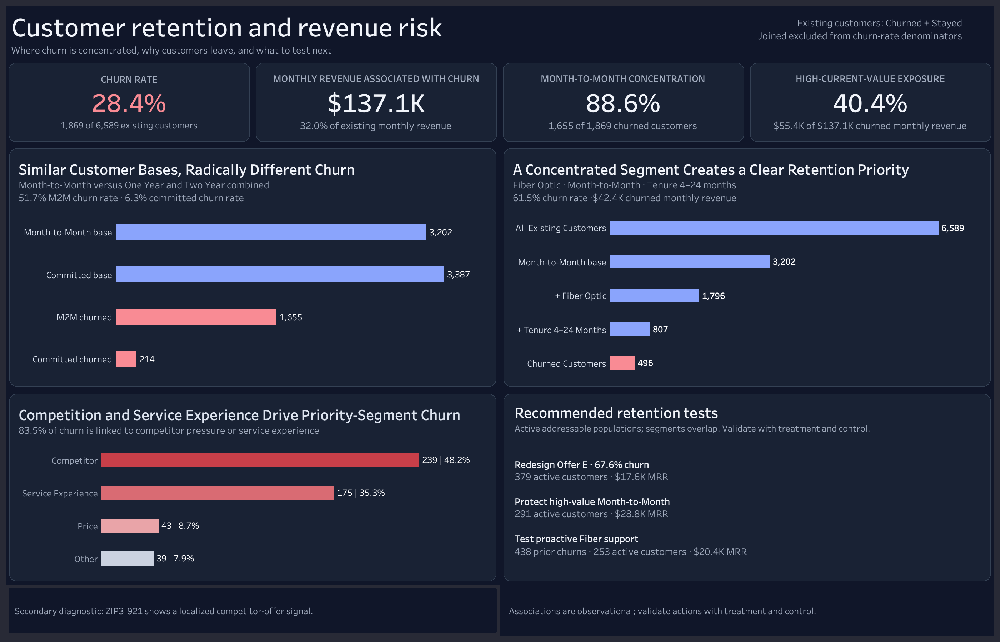

# Telecom Customer Churn Analysis

[](https://github.com/Danaamantini/telecom-customer-churn/actions/workflows/tests.yml)
[](https://www.python.org/)
[](https://duckdb.org/)
[](dashboard/README.md)
[](LICENSE)

Reproducible customer-churn analysis for a fictional California telecom
provider. Python prepares and validates the data, DuckDB reproduces the
business metrics, and Tableau presents the decision narrative.



## Business question

Where is churn concentrated, how much monthly revenue is associated with
churned customers, and which customer groups should be tested first for
retention?

## Executive findings

The analysis uses the complete 7,043-customer snapshot. Churn-rate denominators
exclude the 454 customers whose status is `Joined`.

| Metric | Result |
|---|---:|
| Existing customers (`Stayed + Churned`) | 6,589 |
| Churned customers | 1,869 |
| Churn rate | 28.4% |
| Existing monthly revenue | $428,487.25 |
| Monthly revenue associated with churn | $137,086.65 |
| Share of existing monthly revenue associated with churn | 32.0% |
| Share of churn from Month-to-Month customers | 88.6% |
| High-current-value share of churn-associated revenue | 40.4% |

The customer bases are similar in size, but their outcomes are not:
Month-to-Month has 3,202 existing customers and 1,655 churns, while One Year
and Two Year combined have 3,387 existing customers and 214 churns. Their churn
rates are 51.7% and 6.3%, respectively.

The main retention priority is the 807-customer intersection of Fiber Optic,
Month-to-Month, and tenure from 4 through 24 months. It contains 496 churned
customers, a 61.5% churn rate, and $42.4K in churn-associated monthly revenue.
Within this segment, competitor pressure accounts for 48.2% of churn and
service experience accounts for another 35.3%.

## Recommended tests

1. Redesign Offer E for its 379 current non-churned customers and use a control
   group. The observed existing-customer churn rate for Offer E is 67.6%.
2. Test protection for 291 high-value Month-to-Month customers, representing
   $28.8K in current monthly revenue.
3. Test proactive Fiber support for 253 current customers matching the risk
   profile associated with 438 prior churns and $20.4K in current monthly
   revenue.

These cohorts overlap. Results are observational and should be validated with
treatment and control groups rather than presented as causal effects.

## Reproduce the project

Requires Python 3.12 or newer.

```bash
git clone https://github.com/Danaamantini/telecom-customer-churn.git
cd telecom-customer-churn
python3 -m venv .venv
source .venv/bin/activate       # Windows: .venv\Scripts\activate
pip install -r requirements.txt
```

Download the public-domain [Maven Analytics Telecom Customer Churn dataset](https://mavenanalytics.io/data-playground/telecom-customer-churn)
and place the main customer CSV at:

```text
data/raw/telecom_customer_churn.csv
```

Then run:

```bash
python run_pipeline.py
pytest -q
```

The pipeline validates the 38 source columns, preserves all 7,043 rows,
creates the 43-column customer table, exports
`data/processed/clean_customers.csv`, and builds the documented DuckDB views.

Execute the optional analysis notebooks after the pipeline:

```bash
jupyter nbconvert --to notebook --execute notebooks/01_eda.ipynb --output /tmp/01_eda.ipynb
jupyter nbconvert --to notebook --execute notebooks/02_business_analysis.ipynb --output /tmp/02_business_analysis.ipynb
jupyter nbconvert --to notebook --execute notebooks/03_logistic_model.ipynb --output /tmp/03_logistic_model.ipynb
```

## Project structure

```text
data/         source-data instructions and generated outputs
notebooks/    EDA, business analysis, and optional logistic model
src/          canonical preparation and validation pipeline
sql/          reproducible KPI, segment, revenue, and dashboard views
tests/        synthetic fixture plus unit and integration tests
reports/      written analysis, data dictionary, and generated figures
dashboard/    final Tableau workbook, exported image, and metric definitions
```

## Method

1. Validate the original customer-level source and preserve one row per
   customer.
2. Convert numeric and Yes/No fields without dropping records.
3. Create five transparent features: churn, tenure group, contract commitment,
   bundle count, and Fiber flag.
4. Exclude `Joined` customers from churn-rate denominators.
5. Reconcile Tableau KPIs and targeting segments against the processed CSV and
   DuckDB views.
6. Treat the logistic model as explanatory, not as a production forecast.

See [reports/final_report.md](reports/final_report.md) for the full business
narrative, [reports/data_dictionary.md](reports/data_dictionary.md) for the
data contract, and [dashboard/README.md](dashboard/README.md) for the Tableau
definitions and refresh workflow.

## Reproducibility safeguards

- one canonical Python transformation path;
- exact dependency versions;
- fixed validation totals for the full dataset;
- synthetic test data committed to the repository;
- Python and SQL integration tests;
- automated notebook execution in GitHub Actions;
- generated source data excluded from version control.

## License

Project code is MIT licensed. The source dataset is listed by Maven Analytics
as public domain and originates from IBM Cognos Analytics.
