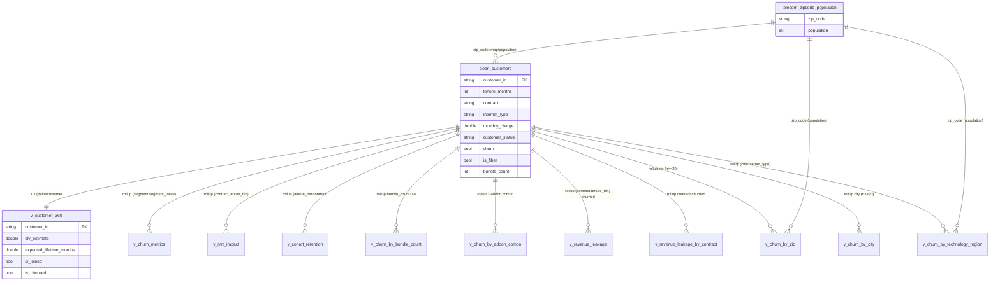

# Tableau Data Sources

Source-of-truth analytical layer for the Telecom Customer Churn dashboards.
All data sources are the `CREATE OR REPLACE` views under `sql/views/`, backed by
the typed/cleaned table `analytics.clean_customers` (produced by
`sql/transformations/020_feature_engineering.sql`).

> **FINAL layer (Stage 5).** `analytics.clean_customers` is the base fact table.
> The seven view **files** (`010`–`050`, `060_revenue_leakage`, `070_regional_churn`)
> materialize **11 logical views**, because `050_service_bundles`,
> `060_revenue_leakage`, and `070_regional_churn` each define more than one view.
> `telecom_zipcode_population` is a secondary reference table (map/population only).

## Semantic model

- **Fact / dimension:** `analytics.clean_customers` is the base table (38 base +
  5 engineered columns). `v_customer_360` is its BI-shaped, customer-level
  projection (adds `is_joined`, `is_churned`, `expected_lifetime_months`,
  `clv_estimate`). Grain of the whole model = **one row per `customer_id`**.
- **Pre-aggregated marts:** every `v_*` view below is a standalone aggregate
  (or the customer-level 360). **Do NOT join the aggregates back to
  `v_customer_360`** — that introduces fan-out and double-counts churned
  customers and revenue.
- **Secondary source (map/regional only):** `telecom_zipcode_population.csv`
  (`Zip Code` → `Population`). Note the regional views (`070`) already LEFT JOIN
  this table server-side, so `v_churn_by_zip` / `v_churn_by_technology_region`
  already carry `population`; a separate Tableau join is only needed when using
  `v_customer_360` directly for the choropleth.

## Data source inventory

| # | Data source (view) | File | Grain | Used for |
|---|---------------------|------|-------|----------|
| 0 | `analytics.clean_customers` | *base table* | one row per `customer_id` | foundation for every view (not consumed directly) |
| 1 | `v_customer_360` | `010_customer_360.sql` | one row per `customer_id` | detail, drill-down, CLV, distributions, churn-reason bars |
| 2 | `v_churn_metrics` | `020_churn_metrics.sql` | one row per `(segment, segment_value)` | segment churn-rate bars/KPIs |
| 3 | `v_mrr_impact` | `030_mrr_impact.sql` | one row per `(contract, tenure_bin)` rollup | MRR at risk (12-mo annualized) |
| 4 | `v_cohort_retention` | `040_cohort_retention.sql` | one row per `(tenure_bin, contract)` | retention heatmap/curves |
| 5 | `v_churn_by_bundle_count` | `050_service_bundles.sql` | one row per `bundle_count` (0–8) | bundle-count churn trend |
| 6 | `v_churn_by_addon_combo` | `050_service_bundles.sql` | one row per 3-add-on combo (8) | retention-driver heatmap |
| 7 | `v_revenue_leakage` | `060_revenue_leakage.sql` | one row per `(contract, tenure_bin)` rollup (churned) | 12/24/36-mo revenue at risk waterfall |
| 8 | `v_revenue_leakage_by_contract` | `060_revenue_leakage.sql` | one row per `contract` (churned) | revenue at risk by contract |
| 9 | `v_churn_by_zip` | `070_regional_churn.sql` | one row per `zip_code` (n ≥ 20) | zip choropleth / hotspot |
| 10 | `v_churn_by_city` | `070_regional_churn.sql` | one row per `city` (n ≥ 20) | city churn bars |
| 11 | `v_churn_by_technology_region` | `070_regional_churn.sql` | one row per `(city, internet_type)` | fiber-vs-other × top-city matrix |
| 12 | `telecom_zipcode_population` | `data/raw/telecom_zipcode_population.csv` | one row per `zip_code` | population normalization for the map |

**Key column contracts (for calculated-field mapping):**

| View | Notable columns |
|------|-----------------|
| `v_customer_360` | `customer_id`, `contract`, `internet_type`, `payment_method`, `tenure_bin`, `offer`, `city`, `zip_code`, `latitude`, `longitude`, `monthly_charge`, `total_revenue`, `customer_status`, `churn_category`, `churn_reason`, `churn`, `is_churned`, `is_joined`, `is_fiber`, `bundle_count`, `premium_tech_support`, `online_security`, `device_protection_plan`, `expected_lifetime_months`, `clv_estimate` |
| `v_churn_metrics` | `segment`, `segment_value`, `total_customers`, `churned_customers`, `churn_rate` |
| `v_mrr_impact` | `contract`, `tenure_bin`, `churned_customers`, `mrr_impact`, `annualized_revenue_at_risk`, `avg_monthly_charge_churned` |
| `v_cohort_retention` | `tenure_bin`, `cohort_min_tenure`, `contract`, `total_customers`, `churned_customers`, `retained_customers`, `retention_rate`, `churn_rate` |
| `v_churn_by_bundle_count` | `bundle_count`, `total_customers`, `churned_customers`, `churn_rate` |
| `v_churn_by_addon_combo` | `has_premium_tech_support`, `has_online_security`, `has_device_protection_plan`, `combo_label`, `total_customers`, `churned_customers`, `churn_rate` |
| `v_revenue_leakage` | `contract`, `tenure_bin`, `churned_customers`, `mrr_impact`, `revenue_at_risk_12m`, `revenue_at_risk_24m`, `revenue_at_risk_36m`, `lifetime_revenue_collected` |
| `v_revenue_leakage_by_contract` | `contract`, `churned_customers`, `mrr_impact`, `revenue_at_risk_12m`, `revenue_at_risk_24m`, `revenue_at_risk_36m`, `avg_monthly_charge_churned` |
| `v_churn_by_zip` | `zip_code`, `city`, `population`, `n`, `churned`, `churn_rate` |
| `v_churn_by_city` | `city`, `n`, `churned`, `churn_rate` |
| `v_churn_by_technology_region` | `internet_type`, `city_rank`, `city`, `city_population`, `n`, `churned`, `churn_rate` |

## Join strategy

- **No joins between the aggregate sources.** Each view is either
  customer-level or pre-aggregated; mixing grains in a single sheet causes
  incorrect aggregation.
- **Drill-down from an aggregate to customers:** do it via `v_customer_360`
  filtered on the same attributes (e.g. `contract`, `internet_type`,
  `tenure_bin`, `city`, `zip_code`), *not* by joining the aggregate back to
  customers.
- **Regional map:** prefer the pre-aggregated `v_churn_by_zip` (already carries
  `population` and an `n ≥ 20` small-sample guard). If a raw choropleth is
  required from `v_customer_360`, use the relationship
  `v_customer_360.zip_code = zipcode_population.Zip Code` in a map-only workbook,
  and aggregate churn on the `v_customer_360` side
  (`SUM(IIF([is_churned],1,0)) / COUNT([customer_id])`), normalizing by
  `Population` via `MAX()`.
- **Revenue-at-risk:** use `v_revenue_leakage` / `v_revenue_leakage_by_contract`
  for the 12/24/36-mo horizon (columns `revenue_at_risk_12m/24m/36m`). Use
  `v_mrr_impact` only when the 12-mo annualized figure alone is needed.
- If a cross-grain view is genuinely required, re-aggregate in SQL (a new view)
  rather than blending in Tableau, to keep formulas reproducible.

## Refresh notes

- The views are **logical** (DuckDB `CREATE OR REPLACE VIEW`) over
  `analytics.clean_customers`. They are always current when `clean_customers` is
  rebuilt.
- For Tableau, use a **published data source** / extract. Recommended refresh:
  - After each pipeline run that rebuilds `clean_customers` → full extract refresh.
  - All aggregate views (11 logical views) are small; refresh with the full
    extract. No incremental logic required (single monthly snapshot).
  - `zipcode_population` is static reference data; refresh on demand.
- Preserve `segment` / `segment_value` dimensions from `v_churn_metrics` as
  strings; set `churn_rate` default number format to **percentage (1 decimal)**.
- Set role of `customer_id` to **dimension (not measure)**; set `churn`,
  `is_churned`, `is_joined`, `is_fiber`, and the boolean add-ons to **boolean**
  so Tableau renders them as discrete filters.
- `zip_code` is VARCHAR (leading zeros preserved) — do not coerce to integer in
  Tableau, or ZCTAs like `01234` will lose their leading zero.
- The `(All contracts)` / `(All tenure)` rollup rows in `v_mrr_impact` and
  `v_revenue_leakage` are the grand-total cells; use them for the KPI band
  (filter to `contract = '(All contracts)'` and `tenure_bin = '(All tenure)'`).

## Parameters (external inputs, not in the dataset)

| Parameter | Default | Used by |
|-----------|---------|---------|
| Gross Margin | `0.50` | CLV |
| Total S&M Spend | *(finance input)* | CAC |
| New Customers Acquired | *(finance input)* | CAC |
